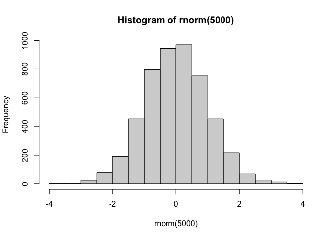
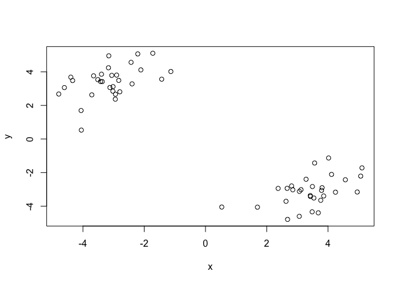
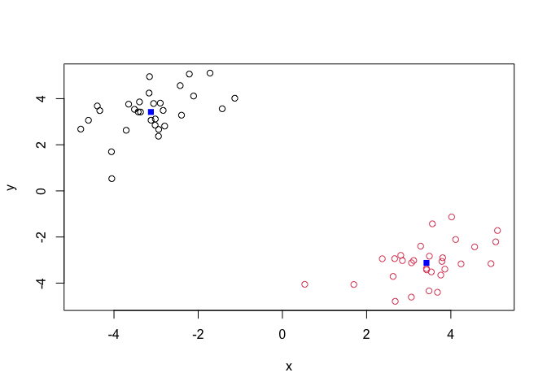
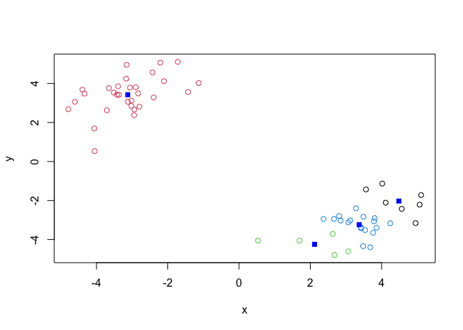
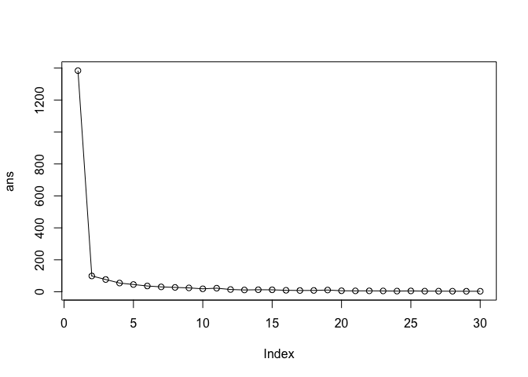
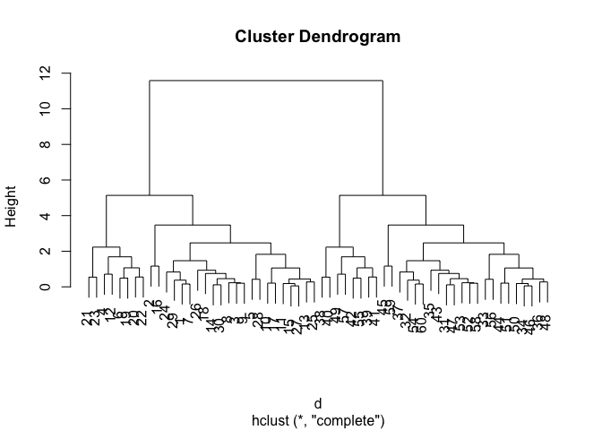
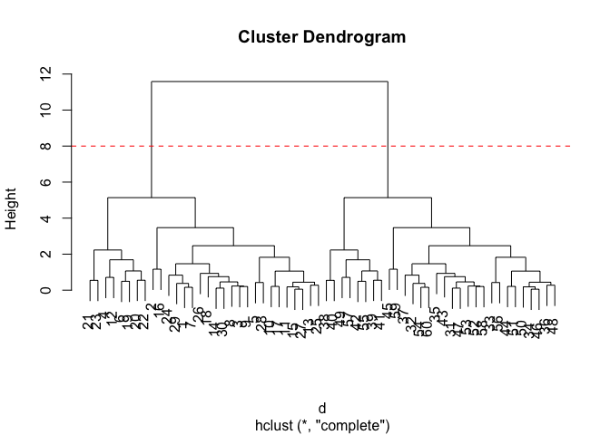

# class7: Machine Learning 1
Ella Chang A17902833

## Background

Today we will begin our exploration of some important machine learning
methods, namely **clustering** and **dimensionality reduction**.

Let’s make up some input data for clustering where we know what the
natural “clusters” are.

The function `rnorm()` can be useful here.

``` r
hist( rnorm(5000))
```



> Q. Generate 30 random numbers centered at +3

``` r
tmp <- c(rnorm(30, mean=3),
         rnorm(30, mean=-3))
x <- cbind(x=tmp, y=rev(tmp))
plot(x)
```



``` r
rbind(letters, rev(letters))
```

            [,1] [,2] [,3] [,4] [,5] [,6] [,7] [,8] [,9] [,10] [,11] [,12] [,13]
    letters "a"  "b"  "c"  "d"  "e"  "f"  "g"  "h"  "i"  "j"   "k"   "l"   "m"  
            "z"  "y"  "x"  "w"  "v"  "u"  "t"  "s"  "r"  "q"   "p"   "o"   "n"  
            [,14] [,15] [,16] [,17] [,18] [,19] [,20] [,21] [,22] [,23] [,24] [,25]
    letters "n"   "o"   "p"   "q"   "r"   "s"   "t"   "u"   "v"   "w"   "x"   "y"  
            "m"   "l"   "k"   "j"   "i"   "h"   "g"   "f"   "e"   "d"   "c"   "b"  
            [,26]
    letters "z"  
            "a"  

## K-means clustering

Tne main function in “base R”

The main function in “base R” for K-means clustering is called
`kmeans()`:

``` r
km <- kmeans(x, centers = 2)
km
```

    K-means clustering with 2 clusters of sizes 30, 30

    Cluster means:
              x         y
    1 -3.122941  3.421452
    2  3.421452 -3.122941

    Clustering vector:
     [1] 2 2 2 2 2 2 2 2 2 2 2 2 2 2 2 2 2 2 2 2 2 2 2 2 2 2 2 2 2 2 1 1 1 1 1 1 1 1
    [39] 1 1 1 1 1 1 1 1 1 1 1 1 1 1 1 1 1 1 1 1 1 1

    Within cluster sum of squares by cluster:
    [1] 49.50002 49.50002
     (between_SS / total_SS =  92.8 %)

    Available components:

    [1] "cluster"      "centers"      "totss"        "withinss"     "tot.withinss"
    [6] "betweenss"    "size"         "iter"         "ifault"      

> Q. What component of the results object details the cluster sizes?

``` r
km$size
```

    [1] 30 30

> Q. What component of the results object details the cluster centers?

> Q. What component of the results object details the cluster membership
> vector (i.e. our main result of which points lie in which cluster)?

``` r
km$cluster
```

     [1] 2 2 2 2 2 2 2 2 2 2 2 2 2 2 2 2 2 2 2 2 2 2 2 2 2 2 2 2 2 2 1 1 1 1 1 1 1 1
    [39] 1 1 1 1 1 1 1 1 1 1 1 1 1 1 1 1 1 1 1 1 1 1

> Q. Plot our clustering results with points colored by cluster and also
> add the cluster centers as new points colored blue?

``` r
plot(x, col=km$cluster)
points(km$centers, col="blue", pch=15)
```



> Q. Run `kmeans()` again and this time produce 4 clusters (and call
> your result object `k4`) and make a results figure like above.

``` r
k4 <- kmeans(x, centers = 4)
plot(x, col = k4$cluster)
points(k4$centers, col="blue", pch=15)
```



The metric

``` r
km$tot.withinss
```

    [1] 99.00004

``` r
k4$tot.withinss
```

    [1] 67.63224

> Q. Let’s try different number of K (centers) from 1 to 30 and see what
> the best result is?

``` r
i <- 1
ans <- NULL
for(i in 1:30) {
  ans <- c(ans, kmeans(x, centers =i)$tot.withinss)
}
ans
```

     [1] 1383.872555   99.000037   76.803476   54.606915   45.435680   36.264445
     [7]   30.560869   27.307305   24.226202   18.522626   22.438663   14.200171
    [13]   11.400972   12.690574   12.222020    9.285158    8.016260    8.368297
    [19]   10.971245    6.295157    5.650843    5.777415    5.292366    4.322927
    [25]    5.344062    3.901220    3.846085    3.485418    3.179570    3.154464

``` r
plot(ans, typ="o")
```



**Key-point:** K-means will impose a clustering structure on your data
even if it is not there - it will always give you the answer you asked
for even if that answer is silly!

## Hierarchical Clustering

The main function for Hierarchical Clusterig is called `hclust()` Unlike
`kmeans()` (which does all the work for you) you can’t just pass
`hclust()` our raw input data. It needs a “distance matrix” like the one
returned from the `dist()` function.

``` r
d <- dist(x)
hc <- hclust(d)
plot(hc)
```



To extract our cluster membership vector from a `hclust()` result object
we have to “cut” our tree at a given height to yield separate
“groups”/“branches”.

``` r
plot(hc)
abline(h=8, col="red", lty=2)
```



To do this we use the `cutree()` function on our `hclust()` object:

``` r
grps <- cutree(hc, h=8)
grps
```

     [1] 1 1 1 1 1 1 1 1 1 1 1 1 1 1 1 1 1 1 1 1 1 1 1 1 1 1 1 1 1 1 2 2 2 2 2 2 2 2
    [39] 2 2 2 2 2 2 2 2 2 2 2 2 2 2 2 2 2 2 2 2 2 2

``` r
table(grps, km$cluster)
```

        
    grps  1  2
       1  0 30
       2 30  0

## PCA of UK Food data

Import the dataset of food consumption in the UK:

``` r
url <- "https://tinyurl.com/UK-foods"
x <- read.csv(url)
x
```

                         X England Wales Scotland N.Ireland
    1               Cheese     105   103      103        66
    2        Carcass_meat      245   227      242       267
    3          Other_meat      685   803      750       586
    4                 Fish     147   160      122        93
    5       Fats_and_oils      193   235      184       209
    6               Sugars     156   175      147       139
    7      Fresh_potatoes      720   874      566      1033
    8           Fresh_Veg      253   265      171       143
    9           Other_Veg      488   570      418       355
    10 Processed_potatoes      198   203      220       187
    11      Processed_Veg      360   365      337       334
    12        Fresh_fruit     1102  1137      957       674
    13            Cereals     1472  1582     1462      1494
    14           Beverages      57    73       53        47
    15        Soft_drinks     1374  1256     1572      1506
    16   Alcoholic_drinks      375   475      458       135
    17      Confectionery       54    64       62        41

> Q.1 How many rows and columns are in your new data frame named x? What
> R functions could you use to answer this questions?

``` r
dim(x)
```

    [1] 17  5

One solution to set the row names is to do it by hand…

``` r
rownames(x) <- x[,1]
```

To remove the first column I can use the minus index trick

``` r
x<- x[,-1]
x
```

                        England Wales Scotland N.Ireland
    Cheese                  105   103      103        66
    Carcass_meat            245   227      242       267
    Other_meat              685   803      750       586
    Fish                    147   160      122        93
    Fats_and_oils           193   235      184       209
    Sugars                  156   175      147       139
    Fresh_potatoes          720   874      566      1033
    Fresh_Veg               253   265      171       143
    Other_Veg               488   570      418       355
    Processed_potatoes      198   203      220       187
    Processed_Veg           360   365      337       334
    Fresh_fruit            1102  1137      957       674
    Cereals                1472  1582     1462      1494
    Beverages                57    73       53        47
    Soft_drinks            1374  1256     1572      1506
    Alcoholic_drinks        375   475      458       135
    Confectionery            54    64       62        41

A better way to do this is to set the row names to the first column with
`read.csv()`

``` r
x <- read.csv(url, row.names = 1)
x
```

                        England Wales Scotland N.Ireland
    Cheese                  105   103      103        66
    Carcass_meat            245   227      242       267
    Other_meat              685   803      750       586
    Fish                    147   160      122        93
    Fats_and_oils           193   235      184       209
    Sugars                  156   175      147       139
    Fresh_potatoes          720   874      566      1033
    Fresh_Veg               253   265      171       143
    Other_Veg               488   570      418       355
    Processed_potatoes      198   203      220       187
    Processed_Veg           360   365      337       334
    Fresh_fruit            1102  1137      957       674
    Cereals                1472  1582     1462      1494
    Beverages                57    73       53        47
    Soft_drinks            1374  1256     1572      1506
    Alcoholic_drinks        375   475      458       135
    Confectionery            54    64       62        41

> Q2. Which approach to solving the ‘row-names problem’ mentioned above
> do you prefer and why? Is one approach more robust than another under
> certain circumstances?

#### Spotting major differences and trends

Is it difficult even in this wee 170 dataset…

``` r
barplot(as.matrix(x), beside=F, col=rainbow(nrow(x)))
```


``` r
rainbow(4)
```

    [1] "#FF0000" "#80FF00" "#00FFFF" "#8000FF"

### Pairs plots and heatmaps

``` r
pairs(x, col=rainbow(nrow(x)), pch=16)
```


``` r
library(pheatmap)

pheatmap( as.matrix(x) )
```


### PCA to the rescue

The main PCA function in “base R’ is called `prcomp()`. This function
wants the transpose of our food data as input (i.e. the foods as columns
and the countries as rows)

``` r
pca<- prcomp(t(x))
```

``` r
summary(pca)
```

    Importance of components:
                                PC1      PC2      PC3     PC4
    Standard deviation     324.1502 212.7478 73.87622 2.7e-14
    Proportion of Variance   0.6744   0.2905  0.03503 0.0e+00
    Cumulative Proportion    0.6744   0.9650  1.00000 1.0e+00

``` r
attributes(pca)
```

    $names
    [1] "sdev"     "rotation" "center"   "scale"    "x"       

    $class
    [1] "prcomp"

To make one of main PCA result figures we turn to `pca$x` the scores
along our new PCs. This is called “PC plot” or “score plot” or
“Ordination plot”…

``` r
pca$x
```

                     PC1         PC2        PC3           PC4
    England   -144.99315   -2.532999 105.768945  1.612425e-14
    Wales     -240.52915 -224.646925 -56.475555  4.751043e-13
    Scotland   -91.86934  286.081786 -44.415495 -6.044349e-13
    N.Ireland  477.39164  -58.901862  -4.877895  1.145386e-13

``` r
my_cols <- c("orange", "red", "blue", "green")
```

``` r
library (ggplot2)

ggplot(pca$x) +
  aes(PC1, PC2)+
  geom_point(col=my_cols)
```


The second major result figure is called a “loadings plot” of “variable
contributions plot” or “weight plot”

``` r
pca$rotation
```

                                 PC1          PC2         PC3          PC4
    Cheese              -0.056955380  0.016012850  0.02394295  0.739145824
    Carcass_meat         0.047927628  0.013915823  0.06367111  0.578851042
    Other_meat          -0.258916658 -0.015331138 -0.55384854 -0.084756407
    Fish                -0.084414983 -0.050754947  0.03906481  0.001282376
    Fats_and_oils       -0.005193623 -0.095388656 -0.12522257  0.012073959
    Sugars              -0.037620983 -0.043021699 -0.03605745  0.011712878
    Fresh_potatoes       0.401402060 -0.715017078 -0.20668248  0.098706764
    Fresh_Veg           -0.151849942 -0.144900268  0.21382237  0.067864113
    Other_Veg           -0.243593729 -0.225450923 -0.05332841  0.017187324
    Processed_potatoes  -0.026886233  0.042850761 -0.07364902  0.020275689
    Processed_Veg       -0.036488269 -0.045451802  0.05289191 -0.013653986
    Fresh_fruit         -0.632640898 -0.177740743  0.40012865  0.088466607
    Cereals             -0.047702858 -0.212599678 -0.35884921  0.201601167
    Beverages           -0.026187756 -0.030560542 -0.04135860 -0.004452115
    Soft_drinks          0.232244140  0.555124311 -0.16942648  0.212426744
    Alcoholic_drinks    -0.463968168  0.113536523 -0.49858320  0.032075763
    Confectionery       -0.029650201  0.005949921 -0.05232164  0.035241822

``` r
ggplot(pca$rotation)+
  aes(PC1, rownames(pca$rotation))+
  geom_col()
```


