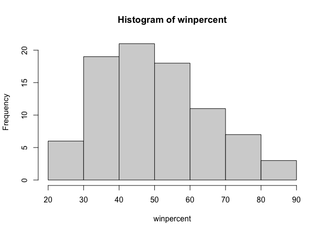
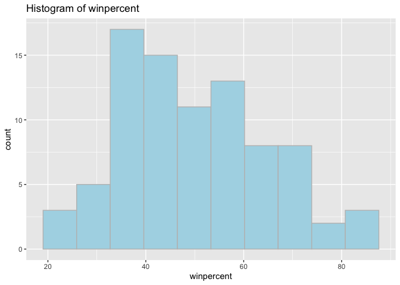
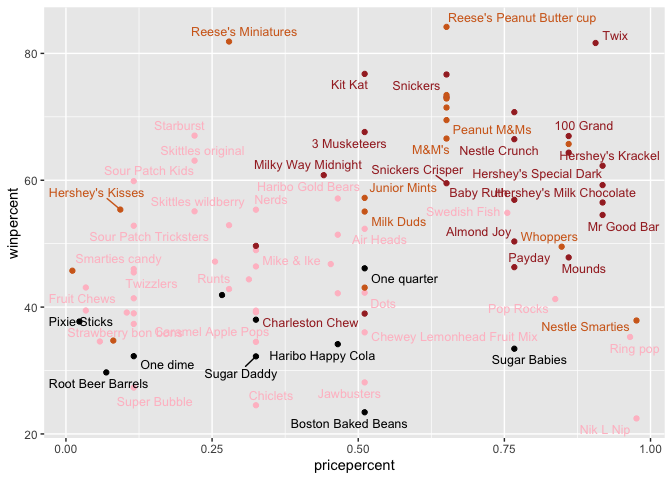
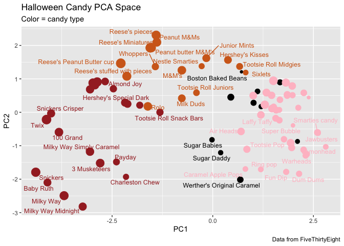
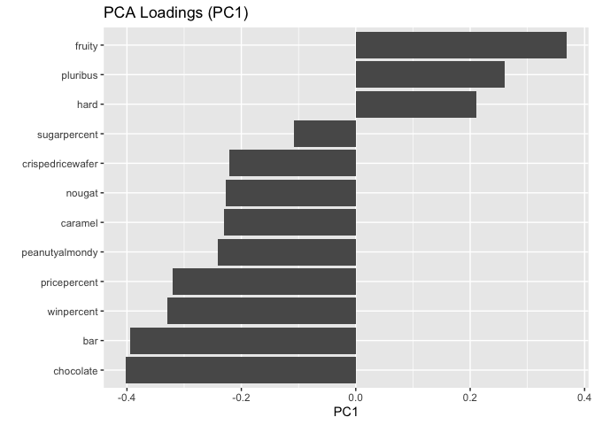

# class9
Ella Chang A17902833

- [What’s In the Dataset?](#whats-in-the-dataset)
- [What Is Your Favorite Candy?](#what-is-your-favorite-candy)
- [3 Exploratory Analysis](#3-exploratory-analysis)
- [Overall Candy Rankings](#overall-candy-rankings)
- [Time to add color](#time-to-add-color)
- [Taking a look at price percent](#taking-a-look-at-price-percent)
- [Exploring Correlation Structure](#exploring-correlation-structure)
- [Principal Component Analysis](#principal-component-analysis)
- [Summary](#summary)

``` r
candy_file <- "https://raw.githubusercontent.com/fivethirtyeight/data/master/candy-power-ranking/candy-data.csv"

candy <- read.csv(candy_file, row.names = 1)
head(candy)
```

                 chocolate fruity caramel peanutyalmondy nougat crispedricewafer
    100 Grand            1      0       1              0      0                1
    3 Musketeers         1      0       0              0      1                0
    One dime             0      0       0              0      0                0
    One quarter          0      0       0              0      0                0
    Air Heads            0      1       0              0      0                0
    Almond Joy           1      0       0              1      0                0
                 hard bar pluribus sugarpercent pricepercent winpercent
    100 Grand       0   1        0        0.732        0.860   66.97173
    3 Musketeers    0   1        0        0.604        0.511   67.60294
    One dime        0   0        0        0.011        0.116   32.26109
    One quarter     0   0        0        0.011        0.511   46.11650
    Air Heads       0   0        0        0.906        0.511   52.34146
    Almond Joy      0   1        0        0.465        0.767   50.34755

## What’s In the Dataset?

> Q1. How many different candy types are in this dataset?

There are `nrow(candy)` rows in this data set

> Q2. How many fruity candy types are in the dataset?

There are `sum(candy$fruity == 1)` fruity candy types.

## What Is Your Favorite Candy?

> Q3. What is your favorite candy (other than Twix) in the dataset and
> what is it’s winpercent value?

84.18029%

``` r
candy["Reese's Peanut Butter cup", "winpercent"]
```

    [1] 84.18029

> Q4. What is the winpercent value for “Kit Kat”?

76.7686%

``` r
candy["Kit Kat", "winpercent"]
```

    [1] 76.7686

> Q5. What is the winpercent value for “Tootsie Roll Snack Bars”?

49.6535%

``` r
candy["Tootsie Roll Snack Bars", "winpercent"]
```

    [1] 49.6535

``` r
library("skimr")
skim(candy)
```

|                                                  |       |
|:-------------------------------------------------|:------|
| Name                                             | candy |
| Number of rows                                   | 85    |
| Number of columns                                | 12    |
| \_\_\_\_\_\_\_\_\_\_\_\_\_\_\_\_\_\_\_\_\_\_\_   |       |
| Column type frequency:                           |       |
| numeric                                          | 12    |
| \_\_\_\_\_\_\_\_\_\_\_\_\_\_\_\_\_\_\_\_\_\_\_\_ |       |
| Group variables                                  | None  |

Data summary

**Variable type: numeric**

| skim_variable | n_missing | complete_rate | mean | sd | p0 | p25 | p50 | p75 | p100 | hist |
|:---|---:|---:|---:|---:|---:|---:|---:|---:|---:|:---|
| chocolate | 0 | 1 | 0.44 | 0.50 | 0.00 | 0.00 | 0.00 | 1.00 | 1.00 | ▇▁▁▁▆ |
| fruity | 0 | 1 | 0.45 | 0.50 | 0.00 | 0.00 | 0.00 | 1.00 | 1.00 | ▇▁▁▁▆ |
| caramel | 0 | 1 | 0.16 | 0.37 | 0.00 | 0.00 | 0.00 | 0.00 | 1.00 | ▇▁▁▁▂ |
| peanutyalmondy | 0 | 1 | 0.16 | 0.37 | 0.00 | 0.00 | 0.00 | 0.00 | 1.00 | ▇▁▁▁▂ |
| nougat | 0 | 1 | 0.08 | 0.28 | 0.00 | 0.00 | 0.00 | 0.00 | 1.00 | ▇▁▁▁▁ |
| crispedricewafer | 0 | 1 | 0.08 | 0.28 | 0.00 | 0.00 | 0.00 | 0.00 | 1.00 | ▇▁▁▁▁ |
| hard | 0 | 1 | 0.18 | 0.38 | 0.00 | 0.00 | 0.00 | 0.00 | 1.00 | ▇▁▁▁▂ |
| bar | 0 | 1 | 0.25 | 0.43 | 0.00 | 0.00 | 0.00 | 0.00 | 1.00 | ▇▁▁▁▂ |
| pluribus | 0 | 1 | 0.52 | 0.50 | 0.00 | 0.00 | 1.00 | 1.00 | 1.00 | ▇▁▁▁▇ |
| sugarpercent | 0 | 1 | 0.48 | 0.28 | 0.01 | 0.22 | 0.47 | 0.73 | 0.99 | ▇▇▇▇▆ |
| pricepercent | 0 | 1 | 0.47 | 0.29 | 0.01 | 0.26 | 0.47 | 0.65 | 0.98 | ▇▇▇▇▆ |
| winpercent | 0 | 1 | 50.32 | 14.71 | 22.45 | 39.14 | 47.83 | 59.86 | 84.18 | ▃▇▆▅▂ |

> Q6. Is there any variable/column that looks to be on a different scale
> to the majority of the other columns in the dataset?

The hist column looks to be on a different scale as it is not numbers,
it is shapes.

> Q7. What do you think a zero and one represent for the
> candy\$chocolate column?

It’s a binary indicator where 1 = has chocolate and 0 = does not.

## 3 Exploratory Analysis

> Q8. Plot a histogram of winpercent values using both base R an
> ggplot2.

``` r
library(ggplot2)
hist(candy$winpercent, main="Histogram of winpercent", xlab="winpercent")
```



``` r
ggplot(candy, aes(x = winpercent)) +
  geom_histogram(bins = 10, fill = "lightblue", col = "grey") +
  labs(title="Histogram of winpercent")
```



> Q9. Is the distribution of winpercent values symmetrical?

No, it is right skewed. \>Q10. Is the center of the distribution above
or below 50%?

Below 50%

``` r
median(candy$winpercent)
```

    [1] 47.82975

``` r
mean(candy$winpercent)
```

    [1] 50.31676

> Q11. On average is chocolate candy higher or lower ranked than fruit
> candy?

Chocolate candy is higher ranked than fruit candy.

Steps to solve this: 1. Find all chocolate candy in the dataset 2.
Extract or find their winpercent values 3. Calculate the mean of these
values

4.  Find all fruit candy
5.  Find their winpercent values
6.  Calculate their mean value

``` r
choc.candy <- candy[candy$chocolate ==1,]
choc.win <- choc.candy$winpercent
mean(choc.win)
```

    [1] 60.92153

``` r
fruit.candy <- candy[candy$fruity ==1,]
fruit.win <- fruit.candy$winpercent
mean(fruit.win)
```

    [1] 44.11974

> Q12. Is this difference statistically significant?

Yes, the p value is 2.871e-08, which is less than 0.05

``` r
t.test(choc.win, fruit.win)
```


        Welch Two Sample t-test

    data:  choc.win and fruit.win
    t = 6.2582, df = 68.882, p-value = 2.871e-08
    alternative hypothesis: true difference in means is not equal to 0
    95 percent confidence interval:
     11.44563 22.15795
    sample estimates:
    mean of x mean of y 
     60.92153  44.11974 

## Overall Candy Rankings

> Q13. What are the five least liked candy types in this set?

The five least liked candy types are Nik L Nip, Boston Baked Beans,
Chiclets, Super Bubble, and Jawbusters.

``` r
inds<- order(candy$winpercent)
candy[inds,]
```

                                chocolate fruity caramel peanutyalmondy nougat
    Nik L Nip                           0      1       0              0      0
    Boston Baked Beans                  0      0       0              1      0
    Chiclets                            0      1       0              0      0
    Super Bubble                        0      1       0              0      0
    Jawbusters                          0      1       0              0      0
    Root Beer Barrels                   0      0       0              0      0
    Sugar Daddy                         0      0       1              0      0
    One dime                            0      0       0              0      0
    Sugar Babies                        0      0       1              0      0
    Haribo Happy Cola                   0      0       0              0      0
    Caramel Apple Pops                  0      1       1              0      0
    Strawberry bon bons                 0      1       0              0      0
    Sixlets                             1      0       0              0      0
    Ring pop                            0      1       0              0      0
    Chewey Lemonhead Fruit Mix          0      1       0              0      0
    Red vines                           0      1       0              0      0
    Pixie Sticks                        0      0       0              0      0
    Nestle Smarties                     1      0       0              0      0
    Candy Corn                          0      0       0              0      0
    Charleston Chew                     1      0       0              0      1
    Warheads                            0      1       0              0      0
    Lemonhead                           0      1       0              0      0
    Fun Dip                             0      1       0              0      0
    Now & Later                         0      1       0              0      0
    Dum Dums                            0      1       0              0      0
    Pop Rocks                           0      1       0              0      0
    Laffy Taffy                         0      1       0              0      0
    Werther's Original Caramel          0      0       1              0      0
    Haribo Twin Snakes                  0      1       0              0      0
    Dots                                0      1       0              0      0
    Runts                               0      1       0              0      0
    Tootsie Roll Juniors                1      0       0              0      0
    Fruit Chews                         0      1       0              0      0
    Welch's Fruit Snacks                0      1       0              0      0
    Twizzlers                           0      1       0              0      0
    Tootsie Roll Midgies                1      0       0              0      0
    Smarties candy                      0      1       0              0      0
    One quarter                         0      0       0              0      0
    Payday                              0      0       0              1      1
    Mike & Ike                          0      1       0              0      0
    Gobstopper                          0      1       0              0      0
    Trolli Sour Bites                   0      1       0              0      0
    Mounds                              1      0       0              0      0
    Tootsie Pop                         1      1       0              0      0
    Whoppers                            1      0       0              0      0
    Tootsie Roll Snack Bars             1      0       0              0      0
    Almond Joy                          1      0       0              1      0
    Haribo Sour Bears                   0      1       0              0      0
    Air Heads                           0      1       0              0      0
    Sour Patch Tricksters               0      1       0              0      0
    Lifesavers big ring gummies         0      1       0              0      0
    Mr Good Bar                         1      0       0              1      0
    Swedish Fish                        0      1       0              0      0
    Milk Duds                           1      0       1              0      0
    Skittles wildberry                  0      1       0              0      0
    Nerds                               0      1       0              0      0
    Hershey's Kisses                    1      0       0              0      0
    Hershey's Milk Chocolate            1      0       0              0      0
    Baby Ruth                           1      0       1              1      1
    Haribo Gold Bears                   0      1       0              0      0
    Junior Mints                        1      0       0              0      0
    Hershey's Special Dark              1      0       0              0      0
    Snickers Crisper                    1      0       1              1      0
    Sour Patch Kids                     0      1       0              0      0
    Milky Way Midnight                  1      0       1              0      1
    Hershey's Krackel                   1      0       0              0      0
    Skittles original                   0      1       0              0      0
    Milky Way Simply Caramel            1      0       1              0      0
    Rolo                                1      0       1              0      0
    Nestle Crunch                       1      0       0              0      0
    M&M's                               1      0       0              0      0
    100 Grand                           1      0       1              0      0
    Starburst                           0      1       0              0      0
    3 Musketeers                        1      0       0              0      1
    Peanut M&Ms                         1      0       0              1      0
    Nestle Butterfinger                 1      0       0              1      0
    Peanut butter M&M's                 1      0       0              1      0
    Reese's stuffed with pieces         1      0       0              1      0
    Milky Way                           1      0       1              0      1
    Reese's pieces                      1      0       0              1      0
    Snickers                            1      0       1              1      1
    Kit Kat                             1      0       0              0      0
    Twix                                1      0       1              0      0
    Reese's Miniatures                  1      0       0              1      0
    Reese's Peanut Butter cup           1      0       0              1      0
                                crispedricewafer hard bar pluribus sugarpercent
    Nik L Nip                                  0    0   0        1        0.197
    Boston Baked Beans                         0    0   0        1        0.313
    Chiclets                                   0    0   0        1        0.046
    Super Bubble                               0    0   0        0        0.162
    Jawbusters                                 0    1   0        1        0.093
    Root Beer Barrels                          0    1   0        1        0.732
    Sugar Daddy                                0    0   0        0        0.418
    One dime                                   0    0   0        0        0.011
    Sugar Babies                               0    0   0        1        0.965
    Haribo Happy Cola                          0    0   0        1        0.465
    Caramel Apple Pops                         0    0   0        0        0.604
    Strawberry bon bons                        0    1   0        1        0.569
    Sixlets                                    0    0   0        1        0.220
    Ring pop                                   0    1   0        0        0.732
    Chewey Lemonhead Fruit Mix                 0    0   0        1        0.732
    Red vines                                  0    0   0        1        0.581
    Pixie Sticks                               0    0   0        1        0.093
    Nestle Smarties                            0    0   0        1        0.267
    Candy Corn                                 0    0   0        1        0.906
    Charleston Chew                            0    0   1        0        0.604
    Warheads                                   0    1   0        0        0.093
    Lemonhead                                  0    1   0        0        0.046
    Fun Dip                                    0    1   0        0        0.732
    Now & Later                                0    0   0        1        0.220
    Dum Dums                                   0    1   0        0        0.732
    Pop Rocks                                  0    1   0        1        0.604
    Laffy Taffy                                0    0   0        0        0.220
    Werther's Original Caramel                 0    1   0        0        0.186
    Haribo Twin Snakes                         0    0   0        1        0.465
    Dots                                       0    0   0        1        0.732
    Runts                                      0    1   0        1        0.872
    Tootsie Roll Juniors                       0    0   0        0        0.313
    Fruit Chews                                0    0   0        1        0.127
    Welch's Fruit Snacks                       0    0   0        1        0.313
    Twizzlers                                  0    0   0        0        0.220
    Tootsie Roll Midgies                       0    0   0        1        0.174
    Smarties candy                             0    1   0        1        0.267
    One quarter                                0    0   0        0        0.011
    Payday                                     0    0   1        0        0.465
    Mike & Ike                                 0    0   0        1        0.872
    Gobstopper                                 0    1   0        1        0.906
    Trolli Sour Bites                          0    0   0        1        0.313
    Mounds                                     0    0   1        0        0.313
    Tootsie Pop                                0    1   0        0        0.604
    Whoppers                                   1    0   0        1        0.872
    Tootsie Roll Snack Bars                    0    0   1        0        0.465
    Almond Joy                                 0    0   1        0        0.465
    Haribo Sour Bears                          0    0   0        1        0.465
    Air Heads                                  0    0   0        0        0.906
    Sour Patch Tricksters                      0    0   0        1        0.069
    Lifesavers big ring gummies                0    0   0        0        0.267
    Mr Good Bar                                0    0   1        0        0.313
    Swedish Fish                               0    0   0        1        0.604
    Milk Duds                                  0    0   0        1        0.302
    Skittles wildberry                         0    0   0        1        0.941
    Nerds                                      0    1   0        1        0.848
    Hershey's Kisses                           0    0   0        1        0.127
    Hershey's Milk Chocolate                   0    0   1        0        0.430
    Baby Ruth                                  0    0   1        0        0.604
    Haribo Gold Bears                          0    0   0        1        0.465
    Junior Mints                               0    0   0        1        0.197
    Hershey's Special Dark                     0    0   1        0        0.430
    Snickers Crisper                           1    0   1        0        0.604
    Sour Patch Kids                            0    0   0        1        0.069
    Milky Way Midnight                         0    0   1        0        0.732
    Hershey's Krackel                          1    0   1        0        0.430
    Skittles original                          0    0   0        1        0.941
    Milky Way Simply Caramel                   0    0   1        0        0.965
    Rolo                                       0    0   0        1        0.860
    Nestle Crunch                              1    0   1        0        0.313
    M&M's                                      0    0   0        1        0.825
    100 Grand                                  1    0   1        0        0.732
    Starburst                                  0    0   0        1        0.151
    3 Musketeers                               0    0   1        0        0.604
    Peanut M&Ms                                0    0   0        1        0.593
    Nestle Butterfinger                        0    0   1        0        0.604
    Peanut butter M&M's                        0    0   0        1        0.825
    Reese's stuffed with pieces                0    0   0        0        0.988
    Milky Way                                  0    0   1        0        0.604
    Reese's pieces                             0    0   0        1        0.406
    Snickers                                   0    0   1        0        0.546
    Kit Kat                                    1    0   1        0        0.313
    Twix                                       1    0   1        0        0.546
    Reese's Miniatures                         0    0   0        0        0.034
    Reese's Peanut Butter cup                  0    0   0        0        0.720
                                pricepercent winpercent
    Nik L Nip                          0.976   22.44534
    Boston Baked Beans                 0.511   23.41782
    Chiclets                           0.325   24.52499
    Super Bubble                       0.116   27.30386
    Jawbusters                         0.511   28.12744
    Root Beer Barrels                  0.069   29.70369
    Sugar Daddy                        0.325   32.23100
    One dime                           0.116   32.26109
    Sugar Babies                       0.767   33.43755
    Haribo Happy Cola                  0.465   34.15896
    Caramel Apple Pops                 0.325   34.51768
    Strawberry bon bons                0.058   34.57899
    Sixlets                            0.081   34.72200
    Ring pop                           0.965   35.29076
    Chewey Lemonhead Fruit Mix         0.511   36.01763
    Red vines                          0.116   37.34852
    Pixie Sticks                       0.023   37.72234
    Nestle Smarties                    0.976   37.88719
    Candy Corn                         0.325   38.01096
    Charleston Chew                    0.511   38.97504
    Warheads                           0.116   39.01190
    Lemonhead                          0.104   39.14106
    Fun Dip                            0.325   39.18550
    Now & Later                        0.325   39.44680
    Dum Dums                           0.034   39.46056
    Pop Rocks                          0.837   41.26551
    Laffy Taffy                        0.116   41.38956
    Werther's Original Caramel         0.267   41.90431
    Haribo Twin Snakes                 0.465   42.17877
    Dots                               0.511   42.27208
    Runts                              0.279   42.84914
    Tootsie Roll Juniors               0.511   43.06890
    Fruit Chews                        0.034   43.08892
    Welch's Fruit Snacks               0.313   44.37552
    Twizzlers                          0.116   45.46628
    Tootsie Roll Midgies               0.011   45.73675
    Smarties candy                     0.116   45.99583
    One quarter                        0.511   46.11650
    Payday                             0.767   46.29660
    Mike & Ike                         0.325   46.41172
    Gobstopper                         0.453   46.78335
    Trolli Sour Bites                  0.255   47.17323
    Mounds                             0.860   47.82975
    Tootsie Pop                        0.325   48.98265
    Whoppers                           0.848   49.52411
    Tootsie Roll Snack Bars            0.325   49.65350
    Almond Joy                         0.767   50.34755
    Haribo Sour Bears                  0.465   51.41243
    Air Heads                          0.511   52.34146
    Sour Patch Tricksters              0.116   52.82595
    Lifesavers big ring gummies        0.279   52.91139
    Mr Good Bar                        0.918   54.52645
    Swedish Fish                       0.755   54.86111
    Milk Duds                          0.511   55.06407
    Skittles wildberry                 0.220   55.10370
    Nerds                              0.325   55.35405
    Hershey's Kisses                   0.093   55.37545
    Hershey's Milk Chocolate           0.918   56.49050
    Baby Ruth                          0.767   56.91455
    Haribo Gold Bears                  0.465   57.11974
    Junior Mints                       0.511   57.21925
    Hershey's Special Dark             0.918   59.23612
    Snickers Crisper                   0.651   59.52925
    Sour Patch Kids                    0.116   59.86400
    Milky Way Midnight                 0.441   60.80070
    Hershey's Krackel                  0.918   62.28448
    Skittles original                  0.220   63.08514
    Milky Way Simply Caramel           0.860   64.35334
    Rolo                               0.860   65.71629
    Nestle Crunch                      0.767   66.47068
    M&M's                              0.651   66.57458
    100 Grand                          0.860   66.97173
    Starburst                          0.220   67.03763
    3 Musketeers                       0.511   67.60294
    Peanut M&Ms                        0.651   69.48379
    Nestle Butterfinger                0.767   70.73564
    Peanut butter M&M's                0.651   71.46505
    Reese's stuffed with pieces        0.651   72.88790
    Milky Way                          0.651   73.09956
    Reese's pieces                     0.651   73.43499
    Snickers                           0.651   76.67378
    Kit Kat                            0.511   76.76860
    Twix                               0.906   81.64291
    Reese's Miniatures                 0.279   81.86626
    Reese's Peanut Butter cup          0.651   84.18029

> Q14. What are the top 5 all time favorite candy types out of this set?

The top 5 all time favorite candies are Reese’s Peanut Butter cup,
Reese’s Miniatures, Twix, Kit Kat, and Snickers.

``` r
candy[order(candy$winpercent, decreasing = T)[1:5],]
```

                              chocolate fruity caramel peanutyalmondy nougat
    Reese's Peanut Butter cup         1      0       0              1      0
    Reese's Miniatures                1      0       0              1      0
    Twix                              1      0       1              0      0
    Kit Kat                           1      0       0              0      0
    Snickers                          1      0       1              1      1
                              crispedricewafer hard bar pluribus sugarpercent
    Reese's Peanut Butter cup                0    0   0        0        0.720
    Reese's Miniatures                       0    0   0        0        0.034
    Twix                                     1    0   1        0        0.546
    Kit Kat                                  1    0   1        0        0.313
    Snickers                                 0    0   1        0        0.546
                              pricepercent winpercent
    Reese's Peanut Butter cup        0.651   84.18029
    Reese's Miniatures               0.279   81.86626
    Twix                             0.906   81.64291
    Kit Kat                          0.511   76.76860
    Snickers                         0.651   76.67378

> Q15. Make a first barplot of candy ranking based on winpercent values.

``` r
ggplot(candy) +
  aes(x = winpercent, y = rownames(candy)) +
  geom_col()
```


``` r
ggsave("barplot1.png", height=10, width=6)
```

> Q16. This is quite ugly, use the reorder() function to get the bars
> sorted by winpercent?

``` r
ggplot(candy) +
  aes(winpercent, 
      reorder(rownames(candy), winpercent)) +
  geom_col() +
  ylab("") #turn off ylabel that we don't need
```


``` r
ggsave("barplot2.png", height=10, width=6)
```


## Time to add color

``` r
my_cols=rep("black", nrow(candy))
my_cols[as.logical(candy$chocolate)] = "chocolate"
my_cols[as.logical(candy$bar)] = "brown"
my_cols[as.logical(candy$fruity)] = "pink"
```

``` r
ggplot(candy) + 
  aes(winpercent, reorder(rownames(candy),winpercent)) +
  geom_col(fill=my_cols) 
```


> Q17. What is the worst ranked chocolate candy?

The worst ranked chocolate candy are Sixlets.

> Q18. What is the best ranked fruity candy?

The best ranked fruity candy is Starburst.

## Taking a look at price percent

``` r
library(ggrepel)
ggplot(candy) +
  aes(x = pricepercent, y = winpercent, label = rownames(candy)) +
  geom_point(col = my_cols) +
  geom_text_repel(col = my_cols, size = 3.3, max.overlaps = 5)
```

    Warning: ggrepel: 27 unlabeled data points (too many overlaps). Consider
    increasing max.overlaps



> Q19. Which candy type is the highest ranked in terms of winpercent for
> the least money - i.e. offers the most bang for your buck?

The highest ranked candy in terms of winpercent for the least money is
Hershey’s Kisses.

``` r
ord2 <- order(candy$pricepercent)
head(candy[ord2, c(11,12)], n = 10)
```

                         pricepercent winpercent
    Tootsie Roll Midgies        0.011   45.73675
    Pixie Sticks                0.023   37.72234
    Dum Dums                    0.034   39.46056
    Fruit Chews                 0.034   43.08892
    Strawberry bon bons         0.058   34.57899
    Root Beer Barrels           0.069   29.70369
    Sixlets                     0.081   34.72200
    Hershey's Kisses            0.093   55.37545
    Lemonhead                   0.104   39.14106
    One dime                    0.116   32.26109

> Q20. What are the top 5 most expensive candy types in the dataset and
> of these which is the least popular?

The top 5 most expensive candy types are Nik L Nip, Ring pop, Nestle
Smarties, Hershey’s Krackel, and Mr Good Bar. The least popular is Nik L
Nip.

``` r
ord <- order(candy$pricepercent, decreasing = TRUE)
head(candy[ord, c(11,12)], n = 5)
```

                             pricepercent winpercent
    Nik L Nip                       0.976   22.44534
    Nestle Smarties                 0.976   37.88719
    Ring pop                        0.965   35.29076
    Hershey's Krackel               0.918   62.28448
    Hershey's Milk Chocolate        0.918   56.49050

## Exploring Correlation Structure

``` r
library(corrplot)
```

    corrplot 0.95 loaded

``` r
cij <- cor(candy)
corrplot(cij)
```


> Q22. Examining this plot what two variables are anti-correlated
> (i.e. have minus values)?

The two variables that are anti-correlated are chocolate and fruity.

> Q23. Similarly, what two variables are most positively correlated?

The two variables that are most positively correlated are chocolate and
bar.

## Principal Component Analysis

``` r
pca <- prcomp(candy, scale = TRUE)
summary(pca)
```

    Importance of components:
                              PC1    PC2    PC3     PC4    PC5     PC6     PC7
    Standard deviation     2.0788 1.1378 1.1092 1.07533 0.9518 0.81923 0.81530
    Proportion of Variance 0.3601 0.1079 0.1025 0.09636 0.0755 0.05593 0.05539
    Cumulative Proportion  0.3601 0.4680 0.5705 0.66688 0.7424 0.79830 0.85369
                               PC8     PC9    PC10    PC11    PC12
    Standard deviation     0.74530 0.67824 0.62349 0.43974 0.39760
    Proportion of Variance 0.04629 0.03833 0.03239 0.01611 0.01317
    Cumulative Proportion  0.89998 0.93832 0.97071 0.98683 1.00000

``` r
plot(pca$x[,1:2])
```


``` r
plot(pca$x[,1:2], col=my_cols, pch=16)
```


``` r
# Make a new data-frame with our PCA results and candy data
my_data <- cbind(candy, pca$x[,1:3])
```

``` r
p <- ggplot(my_data) + 
  aes(x = PC1, y = PC2,
      size = winpercent/100,
      label = rownames(my_data),
      text = rownames(my_data)) +
  geom_point(col = my_cols)

p + geom_text_repel(size=3.3, col=my_cols, max.overlaps=7) +
  theme(legend.position="none") +
  labs(title="Halloween Candy PCA Space",
       subtitle="Color = candy type",
       caption="Data from FiveThirtyEight")
```

    Warning: ggrepel: 39 unlabeled data points (too many overlaps). Consider
    increasing max.overlaps



> Q24. Complete the code to generate the loadings plot above. What
> original variables are picked up strongly by PC1 in the positive
> direction? Do these make sense to you? Where did you see this
> relationship highlighted previously?

The original variables that are picked up strongly by PC1 in the
positive direction are fruity, hard, and pluribus. Although initally
this doesn’t make sense, the sign is arbitrary. PC1 primarily represents
a contrast between fruity and hard candy vs chocolate candy bars. This
same pattern was observed earlier in the correlation matrix and candy
rankings, where chocolate and fruity variables were anti-correlated.

``` r
load1 <- data.frame(var = rownames(pca$rotation),
                    PC1 = pca$rotation[,1])

ggplot(load1) +
  aes(x = PC1, y = reorder(var, PC1)) +
  geom_col() +
  labs(title = "PCA Loadings (PC1)",
       x = "PC1", y = "")
```



## Summary

> Q25. Based on your exploratory analysis, correlation findings, and PCA
> results, what combination of characteristics appears to make a
> “winning” candy? How do these different analyses (visualization,
> correlation, PCA) support or complement each other in reaching this
> conclusion?

For this dataset, “winning” candies are those based on chocolate,
particularly chocolate bars, and include those with peanut/almond and/or
caramel/wafer coatings, while avoiding fruity or hard candies. The
ranked bar plots reveal that the top candies are all based on chocolate
bars, correlations reveal a positive relationship for chocolate and
winpercent, a negative relationship for fruity and winpercent, while PCA
shows a primary component (PC1) where the primary differentiation is
based on whether a candy is a chocolate/bar candy or a fruity/hard
candy, placing many winning candies in the first category.
